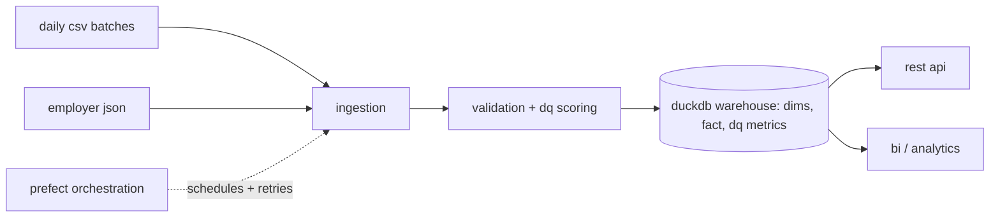
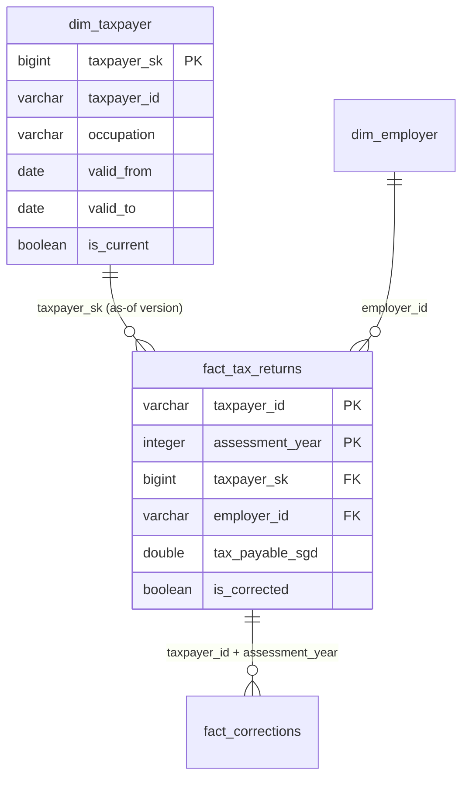
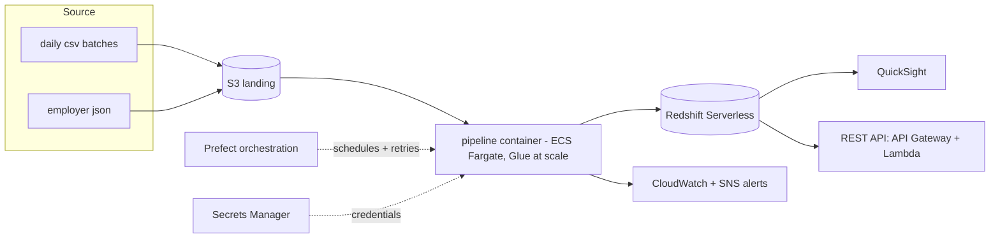

# Technical Design

1. [Overview](#overview)
2. [Data flow](#data-flow)
3. [Ingestion](#ingestion)
4. [Data quality and validation](#data-quality-and-validation)
5. [Data model and transformation](#data-model-and-transformation)
6. [Orchestration](#orchestration)
7. [Technology decisions](#technology-decisions)
8. [Scalability analysis](#scalability-analysis)
9. [Cloud architecture](#cloud-architecture-aws)
10. [Assumptions and design decisions](#assumptions-and-design-decisions)

## Overview

This pipeline ingests raw, uncleaned individual tax-return data into an analytics warehouse.
Daily CSV batches and an employer JSON are validated and scored for quality, then loaded into a
dimensional model that tracks history and handles late and corrected records. A Prefect
orchestration flow runs the pipeline end to end, with FastAPI as the query layer.

Note: each layer is modular and can be tested and replaced on its own.

## Data flow

## Ingestion

The CSV extractor normalises every batch to a single canonical 21-column schema (day 1 has 19
columns, and days 2-3 add columns `batch_date` and `record_type`). Fields are read as text first
so values keep their exact form - otherwise, for example, the postal code `008906` would lose its
leading zeros and become `8906`.

The employer JSON is parsed record by record with defaults and best-effort coercion: the string
`"320"` becomes the number `320`, a null `uen` is kept as missing, and unexpected fields are
dropped (one employer carries `global_hq` and `subsidiary_of`, which no other record has). The
extra fields are dropped so every employer keeps the same shape for the warehouse.

## Data quality and validation

| Rule | Check | Domain |
|---|---|---|
| 1 | NRIC present | Completeness |
| 2 | NRIC format `[STFG]NNNNNNN[A-Z]` | Validity |
| 3 | Postal code is 6 digits | Validity |
| 4 | Filing date is a real date after the assessment year | Validity |
| 5 | `chargeable_income = annual_income - total_reliefs` | Accuracy |
| 6 | CPF present for Residents | Accuracy |

A domain's score is `passing rows / total rows x 100`, and a row passes a domain only if it
passes every rule in that domain. Bad values are parsed to a safe `NULL` and flagged - they still
load and the source can correct them later.

For example, these rows load but are flagged:

| taxpayer_id | issue | fails |
|---|---|---|
| SG050 | NRIC missing | Completeness (R1) + Validity (R2) |
| SG051 | postal `INVALID`, filing date `2024-13-45` | Validity (R3, R4) |
| SG062 | chargeable income does not match annual - reliefs | Accuracy (R5) |

## Data model and transformation

The warehouse is a small star schema in DuckDB.

### The tables

**`dim_taxpayer`** - one row per *version* of a taxpayer.
1. **Holds:** descriptive attributes - name, NRIC, occupation, residential status, postal code,
   housing type, dependents.
2. **Primary key:** `taxpayer_sk`, a number auto-generated from a database sequence (1, 2, 3,
   ...) - one `taxpayer_id` spans many versions, so the id alone cannot be the key.
3. **Links:** referenced by `fact_tax_returns` via `taxpayer_sk`.
4. **Note:** keeps history with SCD Type 2 - when an attribute changes, the current row is closed
   (`valid_to` set, `is_current = false`) and a new current row is opened.

**`dim_employer`** - one row per employer.
1. **Holds:** reference data from the JSON - company name, UEN, industry, address, employee count.
2. **Primary key:** `employer_id`.
3. **Links:** referenced by `fact_tax_returns` via `employer_id`.
4. **Note:** no history, just a simple lookup. A single `UNKNOWN` row catches the ~20% of returns
   (the self-employed) with no employer match, so every fact row still has a valid employer
   reference.

**`fact_tax_returns`** - one row per return (the numbers).
1. **Holds:** the measures - annual income, chargeable income, tax payable, tax paid, reliefs, CPF.
2. **Primary key:** `(taxpayer_id, assessment_year)`.
3. **Links:** to `dim_employer` via `employer_id`, and to `dim_taxpayer` via `taxpayer_sk` -
   specifically the version valid **on the filing date**, so a return reflects who the taxpayer
   was when they filed (this is also how a late-arriving filing resolves to the right historical
   version, not the latest).
4. **Note:** an `is_corrected` flag marks rows that a correction has fixed.

**`agg_data_quality_metrics`** - one row per (batch, domain).
1. **Holds:** the DQ score, passing count, and total for each domain on each batch run.
2. **Primary key:** `(batch, domain)`, where `batch` is the load identifier (e.g. `day1`).
3. **Links:** standalone - no foreign key to the dimensions or fact.
4. **Note:** tracks data quality over time.

**`fact_corrections`** - one row per correction.
1. **Holds:** the audit trail - when a correction overwrites a fact, the old money values are
   copied here with the date.
2. **Primary key:** `correction_id`.
3. **Links:** back to `fact_tax_returns` on `(taxpayer_id, assessment_year)` - the fact's key -
   so each audit row can be matched to the return it corrected.
4. **Note:** lets the fact stay lean (corrections overwrite in place) while old values remain
   auditable here.

### How a batch is loaded

The loader handles each row by its `record_type`:

- **new** - add a `dim_taxpayer` version starting at the filing date.
- **update** - close the current version and open a new one (from the batch date), keeping the
  old one as history.
- **correction** - the old value was an *error*, not history: fix the current `dim_taxpayer`
  version in place; on `fact_tax_returns`, overwrite the row with the corrected values and copy
  the old values to `fact_corrections`.

### Idempotency and the correction design

`fact_tax_returns` is loaded as a delete-then-insert on `(taxpayer_id, assessment_year)`, so
re-running the same batch produces the same result - no duplicates, no drift. Corrections
overwrite the fact rather than appending a reversing entry: this keeps the fact lean (one row per
return, safe to `SUM`) and pushes the correction history into `fact_corrections`. Re-running any
batch leaves every table's row counts unchanged - this is covered by the idempotency tests in
`tests/test_warehouse.py`.

## Orchestration

A Prefect flow wires ingest -> validate and score -> load -> DQ report. Each task retries with
growing backoff, and on a final failure it writes an alert file as a notification. The flow takes
a `batch_date` parameter: `all` backfills the history in order, or a single day runs (or
reprocesses) just that batch.

## Technology decisions

| Layer | Choice | Why this over the alternative |
|---|---|---|
| Processing | **pandas** | fast on small data, with a clean migration path to Spark (on Glue) when data size grows |
| Warehouse | **DuckDB** | embedded columnar OLAP with plain SQL that supports the UPDATEs SCD2 needs |
| Transforms | **SQL** | set-based upserts express SCD2 versioning and idempotent loads directly |
| Orchestration | **Prefect** | runs as a plain script with no always-on infrastructure |
| API | **FastAPI** | automatic OpenAPI docs and validation from type hints |
| Tests | **pytest** | automated tests across all layers, run in CI (GitHub Actions) on every push |

---

## Scalability analysis

The pipeline runs single-node today (the data is small) but is designed to scale.

### Where it breaks first

**Single-node, in-memory pandas.** The extractor loads a whole file into memory, and 100M rows
across ~20 columns is roughly 15-40 GB, which is beyond a normal node's RAM. DuckDB also runs on
a single machine, so a 100M-row build under concurrent queries eventually exceeds its memory and
disk, and the fact upsert/joins get expensive past the low hundreds of millions of rows without
partitioning.

### How it would scale

Already built: the pipeline is **incremental and idempotent** (one batch at a time), so daily
loads stay small regardless of total history. That is the foundation. The rest is future work:

- **Partition** by `batch_date` (load) and `assessment_year` (query) so each run and query touches
  only its slice.
- **Columnar Parquet** on object storage for partition pruning.
- Move the heavy transform from **pandas to Spark** (Glue/EMR), and DuckDB to a distributed
  warehouse like Snowflake.

### When to switch pandas -> Spark

Around **5-10M rows** - pandas needs several times the raw data size in RAM for intermediate
operations, so a wide batch around that size approaches a typical 8-16 GB node's limit. Below
that, pandas + DuckDB are simpler, cheaper, and faster (Spark's overhead costs more than it
saves). The switch is not a rewrite - the validation and transforms port to PySpark / Spark SQL,
running on AWS Glue or EMR.

### Cost justification

The workload runs briefly once a day and is idle the rest of the time, so an always-on cluster
would mostly pay for idle hours. Default to **serverless, pay-per-use** (Fargate, Glue, Redshift
Serverless, Lambda) - you pay only while it runs.

Partitioning + columnar storage cut cost further, since engines bill by data scanned. The
trade-off flips only under sustained, high-concurrency querying: there a provisioned Redshift
cluster or EMR can beat paying serverless rates all day.

## Cloud architecture (AWS)

| Component | Service | Why |
|---|---|---|
| Raw landing | **S3** | cheap, durable landing zone; partition by date; event triggers |
| Compute now | **ECS Fargate** | runs the exact Docker image, serverless, no servers to manage |
| Compute at scale | **AWS Glue (PySpark)** | serverless Spark; Glue manages the cluster |
| Orchestration | **Prefect Cloud** (or self-host worker on ECS) | runs the existing flow; schedules, retries, alerts |
| Warehouse | **Redshift Serverless** | warehouse-grade performance + concurrency for sustained analytics, without the always-on cost; Athena+S3 is the lighter alternative for ad-hoc use |
| BI | **QuickSight** | native BI on the warehouse |
| API | **API Gateway + Lambda** | serverless, pay-per-request; rate limiting belongs here, not in app code |
| Monitoring | **CloudWatch + SNS** | logs/metrics; SNS turns the failure alert into email/Slack |
| Secrets | **Secrets Manager** | DB credentials and API keys, never in code |
| Infra-as-code | **Terraform** | reproducible infrastructure |

The current local stack maps one-to-one: DuckDB -> Redshift Serverless, the Prefect script -> a
scheduled Prefect worker, local files -> S3, and the Docker image -> the same image on ECS.

---

## Assumptions and design decisions

Key assumptions and the reasoning behind them.

### Data handling
- **`data/` is read-only, immutable source.** The pipeline never writes back to it; all output
  goes to the warehouse.
- **Parse-and-flag, don't repair.** Bad values are coerced to a safe `NULL` and flagged, never
  guessed or fixed. Fabricating a tax record would be wrong, so corrections come from the source
  as `correction` records.
- **No quality gate.** A low-scoring batch still loads - the score measures quality, it does not
  block the load.
- **Day 1 rows are the initial load** - day 1 has no `record_type`, so those rows default to
  `new`.

### Modelling
- **Only `dim_taxpayer` gets a surrogate key.** SCD2 gives one taxpayer many versions, so
  `taxpayer_id` cannot be the primary key; a generated `taxpayer_sk` is used instead.
  `dim_employer` has no history, so its primary key is just `employer_id`.
- **Validity dates:** a taxpayer's first version starts at its `filing_date`; a later change
  starts at the `batch_date`. If a taxpayer files on the same day their update batch arrives, the
  prior version has a zero-length window (same day), which is harmless and the as-of join still
  resolves correctly.
- **`update` vs `correction`:** an `update` is a real change (new SCD2 version, history kept); a
  `correction` is a fix to an error (overwrite the current dim version in place, overwrite the
  fact, audit the old values).
- **Each fact row is one taxpayer's return for one year** (`taxpayer_id` + `assessment_year`).
  Corrections overwrite that row rather than adding new ones, so totals stay summable; old values
  live in `fact_corrections`.
- **Correction strategy:** overwrite + audit table was chosen over an immutable reversing-entry
  ledger, which would add rows to the largest table and force every query to sum the net.
- **Unmatched employers** (~20%, self-employed) map to a single `UNKNOWN` employer record.

### Rule interpretations

Where a rule needed a judgment call (rules 1, 2, 3 and 5 are unambiguous and need none):
- **Rule 4** - valid only if the filing date parses to a real date **and** falls after the
  assessment year.
- **Rule 6** - "CPF mandatory for Residents" read literally: Residents must have CPF > 0;
  non-residents are exempted.
- **A blank NRIC** fails both Rule 1 (present) and Rule 2 (format), since each rule is applied
  independently.
- **Scope** - DQ scoring covers the individual tax returns only.

### Scale and data notes
- The pipeline runs **single-node** now; it is *designed* for 100M records, but not *run* at that
  volume.
